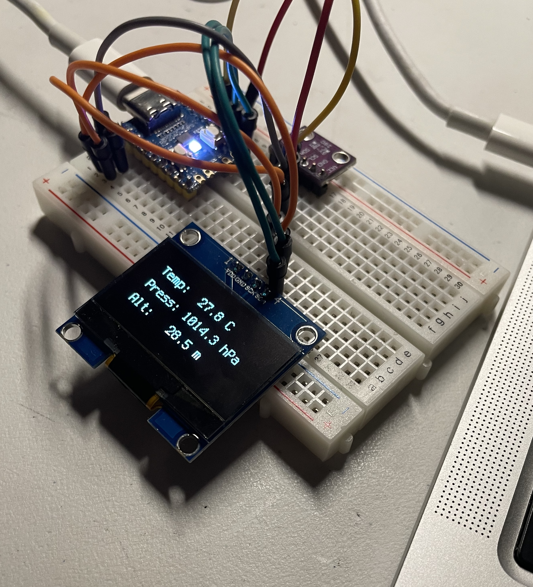
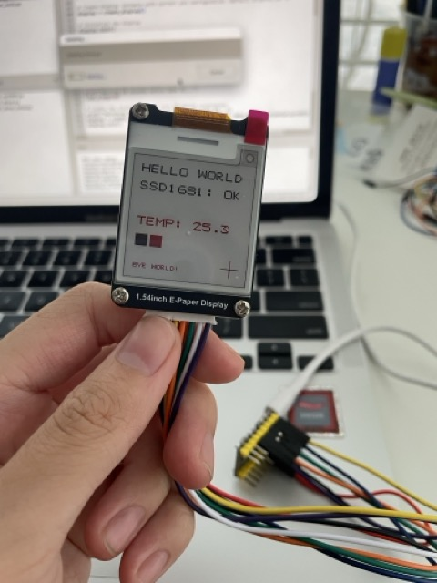
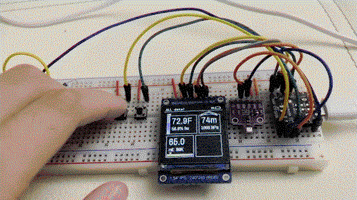

## outdoorsy-gadget

The **EN.FO** is a personal project for tracking the environment when outdoors. It measures altitude (pressure), temperature, humidity, and air quality through the BME680 chip. It also has games now!

Around the end stages submitted to hack club stardance, which is why I'm making this readme a bit longer.

Some sorta cool stuff:

CAD model - https://cad.onshape.com/documents/2de4779b51845175f3a3e786/w/7837df9d32ef23797361ec83/e/9a8511381228d62ac6592067?renderMode=0&uiState=6abf75e68beab4dd691114fb

## info

programs that go into the microcontroller are  `src`, `graphics`, `settings.json`, `logger.json`, and `fontsPCF`, side by side on root. `/` I use vscode to program, but I used Thonny to handle the flashing. You also have to install the libraries separately on Thonny, but it only takes a bit.

### BOM

| part | name |
| ---- | ---- |
| microcontroller | a seeed studio esp32-c6 |
| environment sensor | a (purple) CJMCU-680 breakout board of BME680 |
| screen | 1.54inch 240x240 TFT LCD (ST7789) |
| battery management | a black mini 3.3V UPS Power Module from aliexpress |
| battery | 1000 mAh LiPo (603443) |
| JST connector | 2.0mm JST connector, female |
| 2 buttons | just 6x6x8 (tbd?) buttons  |
| blue translucent filament | protopasta |
| transparent petg | amazon |

### Testing it

You could test it yourself if you wanted to. All you need is a similar ST7789-driven screen, any microcontroller around the level of esp32 (512kb ram basically) and a bme680.

Or alternatively sim it on computer