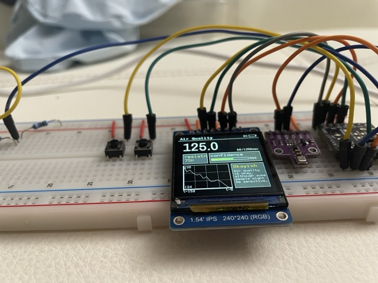
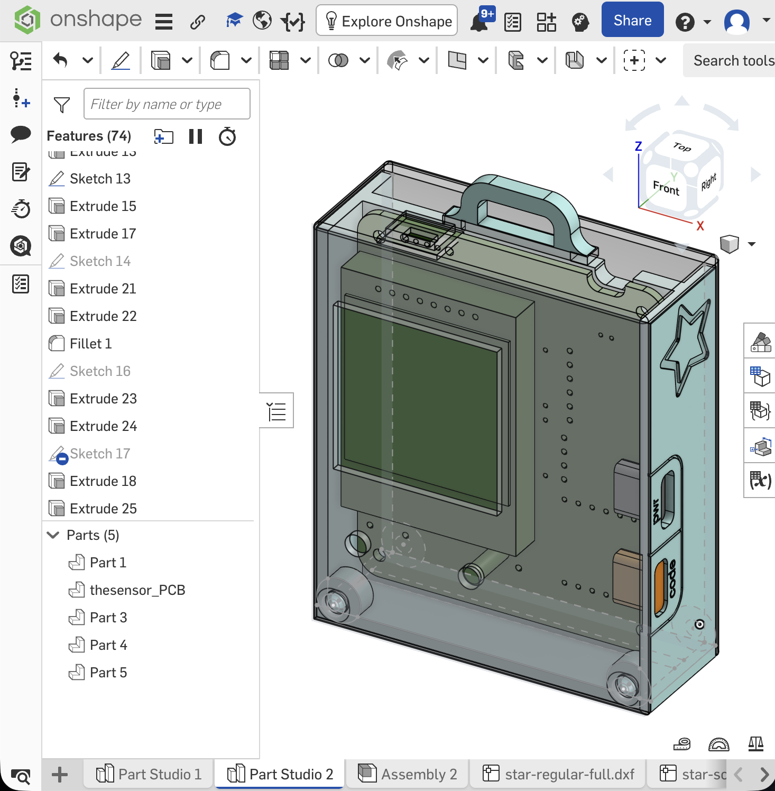
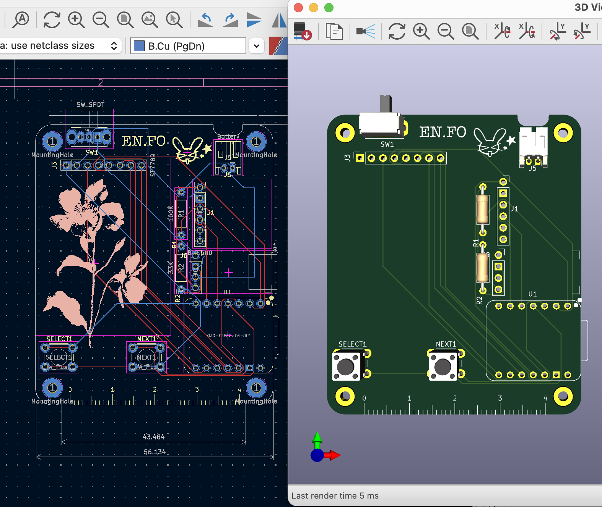

## outdoorsy-gadget

The **EN.FO** is a personal project for tracking the environment when outdoors. It measures altitude (pressure), temperature, humidity, and air quality through the BME680 chip. And it also has games now :3c

Around the end stages submitted to hack club stardance.

## Why I made this

I found a BME680 in a store, and I'd seen people making these home weather station setups and using temperature sensors for their first projects. I thought it would be cool to be able to track the weather while outside too, like while hiking or going somewhere without wifi! 

It would be pretty neat to get momentary values from a sensor for the surrounding area instead of looking online.

## CAD models

https://cad.onshape.com/documents/2de4779b51845175f3a3e786/w/7837df9d32ef23797361ec83/e/9a8511381228d62ac6592067?renderMode=0&uiState=6abf75e68beab4dd691114fb 

## Flashing to ESP32

**Materials:** 
- You want an esp32 with at least 512kb of RAM, or else it can't run the heavy graphics of circuitpython.
- You need a similar ST7789-driven screen, a microcontroller as specified above, and a bme680.
- Also, having a fuse would probably be good (just in case you short out components).

I use vscode to program, but I used Thonny to handle the flashing.
- Programs that go into the microcontroller are  `src`, `graphics`, `settings.json`, `logger.json`, and `fontsPCF`, side by side on root`/`. 
- You also have to install the libraries separately on Thonny, but it only takes a bit.

## Testing the program locally

I wanted to test the UI quickly, so the computer simulation is for that. The data is simulated in `mockIC.py`. 

`⚠️` Important note!! Open the `firmware` folder by itself! Otherwise, vscode will read the file paths incorrectly.

## Other images

This project originally started with a BMP & an e-ink, but gradually didn't work for the use case. I have a cool e-ink now, though.

